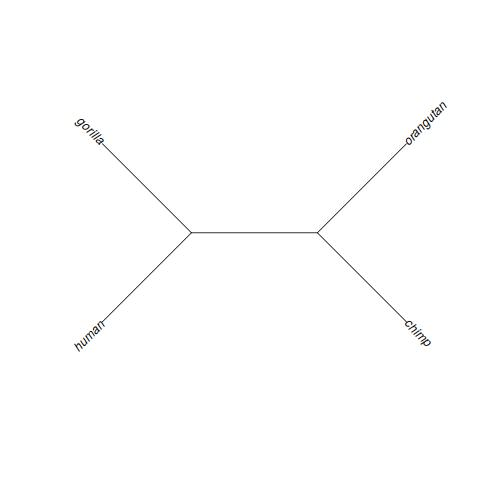
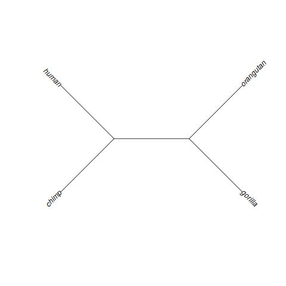
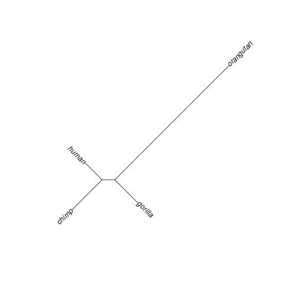
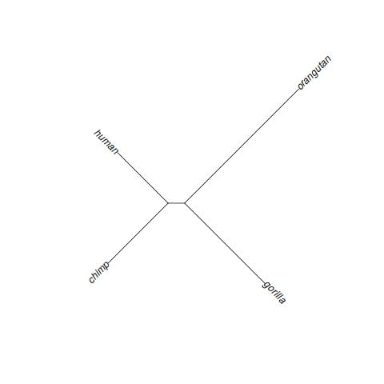
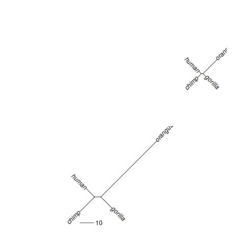
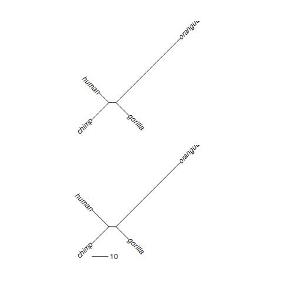
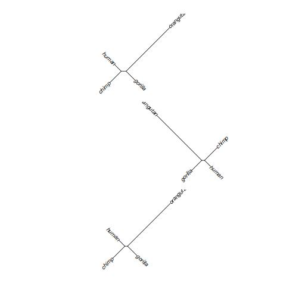
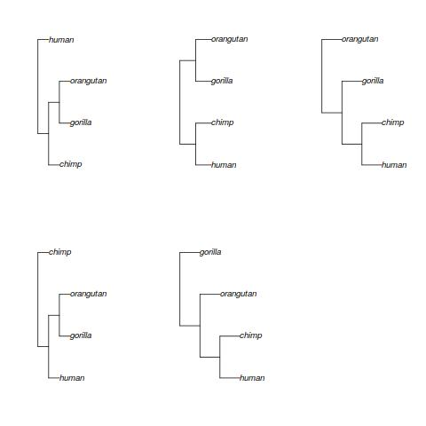
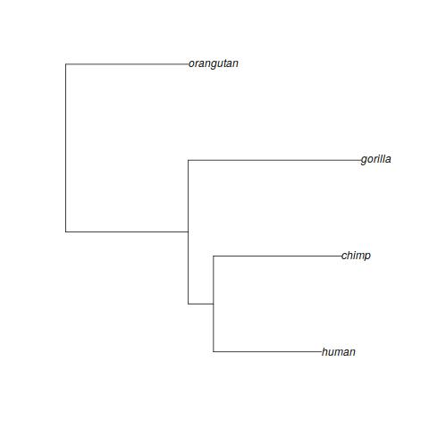
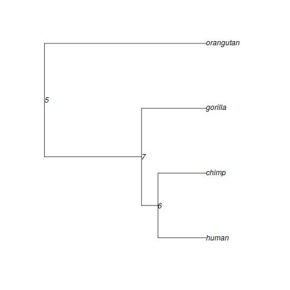

#R-package PhyloEpiGenomics

## Installation

```R
install.packages("devtools", repos="http://cloud.r-project.org", clean=T)
devtools::install_github("hoffmann-lab/PhyloEpiGenomics", upgrade="never", force=T, clean=T)
```
## Guide / Overview

### Table of contents
1. [Data preprocessing](#preprocessing)
2. [Maximum likelihood ](#ml)
  2.1 [Creation of evolutionary models](#models)
  2.2 [Simple tree reconstruction](#simple_ml)
  2.3 [Molecular clocks](#clocks)

<a name="preprocessing">
### 1. Data preprocessing

The library works on alignments in the form of dataframes or matrices with sites as rows and species/strains as columns. Examples:

```R
library(PhyloEpiGenomics)
data(PhyloEpiGenomics_example_data)
#nucleotide data (-> nominal scale)
head(nucl_aln)
 human chimp gorilla orangutan
1     C     C       C         C
2     T     T       T         T
3     A     A       A         A
4     G     G       G         A
5     C     C       C         C
6     T     T       T         T

#methylation data (-> interval scale)
head(meth_fraction_aln)
      human     chimp    gorilla orangutan
1 0.8500000 0.9090909 0.83333333 0.7272727
2 0.9565217 0.9565217 0.83333333 1.0000000
3 0.9500000 0.9354839 0.50000000 1.0000000
4 0.8636364 1.0000000 0.90476190 0.9259259
5 0.0000000 0.0000000 0.07142857 0.0000000
6 0.0000000 0.0000000 0.00000000 0.0000000
```

Since the library was primarily designed to analyze discretized epigenomic data, nominal data, such as nucleotides, must first be converted to integers:

```R
nucl_states_aln=sapply(nucl_aln,function(x) as.numeric(factor(x,levels=c("A","C","G","T"))))
head(nucl_states_aln)
     human chimp gorilla orangutan
[1,]     2     2       2         2
[2,]     4     4       4         4
[3,]     1     1       1         1
[4,]     3     3       3         1
[5,]     2     2       2         2
[6,]     4     4       4         4
```

Note that while this works for most implemented evolutionary models and tree reconstruction methods, it makes no sense for the "noJump" model and the adaptation of the parsimony algorithm. Therefore, the respective settings and functions should not be used if the underlying data is nominal.

If the underlying data is interval scaled like the methylation example above, it can used directly for the parsimony functions. For the other tree reconstruction functions, the interval scaled data should be discretized. The example below discretizes the [0,1] interval equally in 5 states:
```R
discretization=list(c(-0.01,0.2),c(0.2,0.4),c(0.4,0.6),c(0.6,0.8),c(0.8,1))
meth_states_aln=discretize(meth_fraction_aln,discretization)
head(meth_states_aln)
  human chimp gorilla orangutan
1     5     5       5         4
2     5     5       5         5
3     5     5       3         5
4     5     5       5         5
5     1     1       1         1
6     1     1       1         1
```
<a name="ml">
### 2. Maximum likelihood 
<a name="models">
#### 2.1 Creation of evolutionary models
Tree reconstruction via maximum likelihood requires an evolutionary model. Several well-known models specific for nucleotide data are implemented: JC69 (Jukes and Cantor 1969), K80 (Kimura 1980), F81 (Felsenstein 1981), HKY85 (Hasegawa et al. 1985). For a description of those models see https://en.wikipedia.org/wiki/Models_of_DNA_evolution. In addition, our COOC (cooccurrence) model works both if the underlying data was originally nominal scaled (e.g. nucleotides or amino acids) or interval/ordinal scaled (e.g. methylation fractions). The noJump model should only be used if the underlying data was interval/ordinal scaled. See <Link to paper or bioRXiv> for the specification of the latter two models. Usage examples:

```R
#model parameters are estimated from data
my_JC69_model=make_evolutionary_model(nucl_states_aln,model="JC69")

#evolutionary models consist of a transition rate matrix Q and an equilibrium frequency vector pi
my_JC69_model
$Q
             A            C            G            T
A -0.010000000  0.003333333  0.003333333  0.003333333
C  0.003333333 -0.010000000  0.003333333  0.003333333
G  0.003333333  0.003333333 -0.010000000  0.003333333
T  0.003333333  0.003333333  0.003333333 -0.010000000

$pi
[1] 0.2975 0.1855 0.2225 0.2945

# models can also be parameterized manually
my_HKY85_model=make_evolutionary_model(model="HKY85",pi=rep(0.25,4),kappa = 2)

# make a 5 states evolutionary model for methylation data (according to the discretization used above)
my_noJump_model=make_evolutionary_model(meth_states_aln,model="noJump",nstates=length(discretization))
my_noJump_model
$Q
            [,1]        [,2]         [,3]         [,4]         [,5]
[1,] -0.00190183  0.00190183  0.000000000  0.000000000  0.000000000
[2,]  0.01165905 -0.01434051  0.002681462  0.000000000  0.000000000
[3,]  0.00000000  0.00190183 -0.010099781  0.008197951  0.000000000
[4,]  0.00000000  0.00000000  0.002681462 -0.025491611  0.022810149
[5,]  0.00000000  0.00000000  0.000000000  0.008197951 -0.008197951

$pi
[1] 0.24675 0.04025 0.05675 0.17350 0.48275
```

<a name="simple_ml">
#### 2.2 Simple tree reconstruction

You can then apply an evolution model of your choice to your data. To do this, you specify the list of tree topologies to be checked and whose branch lengths will each be optimized by the algorithm.

```R
#tree reconstruction functions expect a list of tree topologies that are to be
#examined/compared/optimized; in this case unrooted topologies are used
unrooted_tree_topologies = all_unrooted_tree_topologies(colnames(nucl_states_aln))
#one of the wrong topologies
plot(unrooted_tree_topologies[[2]],
     type = "unrooted",
     lab4ut = "axial")
```


```R
#correct topology
plot(unrooted_tree_topologies[[3]],
     type = "unrooted",
     lab4ut = "axial",
     rotate.tree = 270)
```


The first example reconstructs the best unrooted phylogenetic tree for the nucleotide example introduced above.
```R
ml_best_nucl_tree = find_optimal_tree(nucl_states_aln,
                                      trees = unrooted_tree_topologies,
                                      Q = my_HKY85_model$Q,
                                      pi = my_HKY85_model$pi)
plot(
  ml_best_nucl_tree,
  type = "unrooted",
  lab4ut = "axial",
  rotate.tree = 270
)
```


The second example reconstructs the best unrooted phylogenetic tree for the methylation example introduced above and shows how multiple CPUs can be used to accelerate the calculation.
```R
#tree reconstruction via maximum likelihood using multiple CPU cores,
#methylation example
library(parallel)
#using up to as many CPUs as examined trees reduces the runtime
cluster = makeCluster(max(3, detectCores()))
ml_best_meth_tree = find_optimal_tree(
  cluster = cluster,
  meth_states_aln,
  trees = unrooted_tree_topologies,
  Q = my_noJump_model$Q,
  pi = my_noJump_model$pi
)
plot(
  ml_best_meth_tree,
  type = "unrooted",
  lab4ut = "axial",
  rotate.tree = 270
)
```


<a name="clocks">
#### 2.3 Molecular clocks

It is possible to apply certain constraints for tree reconstruction, e.g., a molecular clock, i.e. same evolutionary rates on all branches of the tree.

```R
#using a clock implies rooted trees
rooted_tree_topologies = all_rooted_tree_topologies(colnames(nucl_states_aln))

#15 tree topologies to examine
cluster2 = makeCluster(max(length(rooted_tree_topologies), detectCores()))

ml_best_nucl_tree_clock = find_optimal_tree(
  cluster = cluster2,
  nucl_states_aln,
  trees = rooted_tree_topologies,
  Q = my_HKY85_model$Q,
  pi = my_HKY85_model$pi,
  clock = T
)
plot(ml_best_nucl_tree_clock)
```


You can also use local clocks to divide the branches of the tree into several groups/classes, where each group has its own evolution rate. In combination with this, you can specify a tree with branch lengths instead of a topology. As a result, the relations of the branch lengths of the original tree are preserved within each branch class.
```R
#use the same rate class "1" for all 5 edges of the unrooted tree
branches_to_evolutionary_rate_classes = rep(1, nrow(ml_best_nucl_tree$edge))
nrow(ml_best_nucl_tree$edge)
branches_to_evolutionary_rate_classes

#reconstructs a tree on methylation data expanding/contracting the form of
#nucleotide tree
ml_meth_tree_based_on_nucl = maximize_tree_log_likelihood_extended(
  meth_states_aln,
  tree = ml_best_nucl_tree,
  Q = my_noJump_model$Q,
  my_noJump_model$pi,
  branches_to_evolutionary_rate_classes = branches_to_evolutionary_rate_classes
)

#resulting meth tree (left bottom) has the same proportions as the nucl tree
#(right top)
kronoviz(
  list(ml_best_nucl_tree, ml_meth_tree_based_on_nucl$tree),
  type = "unrooted",
  lab4ut = "axial",
  rotate.tree = 270
)
add.scale.bar()
```


```R
#now do the same as above but let the human branch vary freely:
#which edge represents human?
h = which(ml_best_nucl_tree$edge[, 2] == which(ml_best_nucl_tree$tip.label ==
                                                 "human"))
#use rate class for human that differs from the rest
branches_to_evolutionary_rate_classes[h] = 2
h
branches_to_evolutionary_rate_classes

ml_meth_tree_based_on_nucl_2 = maximize_tree_log_likelihood_extended(
  meth_states_aln,
  tree = ml_best_nucl_tree,
  Q = my_noJump_model$Q,
  my_noJump_model$pi,
  branches_to_evolutionary_rate_classes = branches_to_evolutionary_rate_classes
)

#while the other 4 branches maintain their proportions, the human branches gets
#longer in the second scenario (down)
kronoviz(
  list(
    ml_meth_tree_based_on_nucl$tree,
    ml_meth_tree_based_on_nucl_2$tree
  ),
  type = "unrooted",
  lab4ut = "axial",
  rotate.tree = 270
)
add.scale.bar()
```


The resulting log-likelihoods can be used for simple hypothesis tests.
```R
#the scenario with the free human branch has one degree of freedom more than the
#scenario that maintained the proportions of the nucl tree
pchisq(
  2 * (
    ml_meth_tree_based_on_nucl_2$lnL - ml_meth_tree_based_on_nucl$lnL
  ),
  1,
  lower.tail = F
)
[1] 3.881899e-24
#-> the scenario s significantly more likely than the scenario that maintained
#the proportions of the nucleotide tree

#the scenario that let all branches vary freely has four degrees of freedom more
#than the scenario that maintained the proportions of the nucl tree
pchisq(2 * (ml_best_meth_tree$lnL - ml_meth_tree_based_on_nucl$lnL),
       4,
       lower.tail = F)
[1] 6.321796e-135
#-> the scenario is also significantly more likely than the scenario that
#maintained the proportions of the nucleotide tree
```

### 2.3 Distance-based methods

Distance-based tree reconstructions first determines pairwise distances between input sequences and then uses only those distances to determine the best fitting tree. For both of these steps the package offers each one method: Maximum likelihood for determination of the distance matrix and Fitch-Margoliash (least squares) for the acual tree reconstruction. Note, that the distance-based maximum likelihood approach needs an evolutionary model (see the respective chapter above). The methods are independent of each other and therefore can also be combined with algorithms outside of this package.  

```R
#get the distance matrix using maximum likelihood
distance_matrix_nucl = maximize_distance_log_likelihoods(nucl_states_aln, Q =
                                    my_HKY85_model$Q, pi = my_HKY85_model$pi)
distance_matrix_nucl
             human    chimp  gorilla orangutan
human     0.000000 2.541479 2.644497  7.023321
chimp     2.541479 0.000000 3.166047  8.251694
gorilla   2.644497 3.166047 0.000000  7.464671
orangutan 7.023321 8.251694 7.464671  0.000000

#reconstruct the tree using neighbour joining from the ape package
require(ape)
nj_best_nucl_tree = nj(distance_matrix_nucl)

#reconstruct the tree using fitch-margoliash
fm_best_nucl_tree = best_fitch_margoliash(distance_matrix_nucl, unrooted_tree_topologies)


kronoviz(
  list(ml_best_nucl_tree,
       nj_best_nucl_tree,
       fm_best_nucl_tree),
  type = "unrooted",
  lab4ut = "axial",
  rotate.tree = 270
)
```


### 2.4 Parsimony

The Parsimony method identifies the tree topology that requires the least number of state changes. 

```R
#parsimony requires rooted trees as input but all rooted trees that represent
#the same unrooted tree result in the same costs, i.e. the method cannot
#determine a good outgroup
pars_best_meth_trees = all_parsimony(meth_states_aln, rooted_trees = rooted_tree_topologies)
sapply(pars_best_meth_trees, function(tree)
  tree$cost_sum)
#these solution are therefore equivalent
layout(matrix(c(1:5, 0), nrow = 2))
sapply(pars_best_meth_trees[11:15], plot)
```


Note, that no branch lengths are assigned. However, other tree reconstruction methods in the package can be used to determine branch lengths. 

```R
#Parsimony does not assign branch lengths, you can use, e.g., maximum likelihood
#for that purpose
pars_best_meth_tree = maximize_tree_log_likelihood(
  meth_states_aln,
  tree = pars_best_meth_trees[[15]],
  Q = my_noJump_model$Q,
  pi = my_noJump_model$pi
)

layout(matrix(1))
plot(pars_best_meth_tree)
Note, that no branch lengths are assigned. However, other tree reconstruction methods in the package can be used to determine branch lengths. 
```


### 2.5 Simulation

Given an evolutionary model (see respective section above), the package allows you to simulate evolution. The first example creates an artificial nucleotide alignment.   
```R
#for the simulation a rooted tree is needed
sim_tree_nucl=ml_best_nucl_tree_clock
#the example takes the tree calculated before but multiplies the time with 7 to
#result in more substitutions
sim_tree_nucl$edge.length=sim_tree_nucl$edge.length*7

#simulate the evolution of 5000 nucleotides
sim_nucl = simulate_evolution(
  nstates = 5000,
  tree = sim_tree_nucl,
  Q = my_HKY85_model$Q,
  pi = my_HKY85_model$pi
)

#the simulation contains also the states at the ancestral nodes
head(sim_nucl$states_alignment)
     human chimp gorilla orangutan 5 7 6
[1,]     2     2       2         2 2 2 2
[2,]     3     3       3         3 3 3 3
[3,]     4     4       4         4 4 4 4
[4,]     2     2       2         2 2 2 2
[5,]     2     2       2         2 2 2 2
[6,]     4     4       4         1 1 4 4

ml_best_nucl_tree_clock$node.label=setNames(5:7,5:7)
plot(ml_best_nucl_tree_clock,show.node.label = T)
```



```R
#convert to ACGT
sim_nucl_aln=apply(sim_nucl$states_alignment,c(1,2),function(x) c("A","C","G","T")[x])
head(sim_nucl_aln)
     human chimp gorilla orangutan 5   7   6  
[1,] "C"   "C"   "C"     "C"       "C" "C" "C"
[2,] "G"   "G"   "G"     "G"       "G" "G" "G"
[3,] "T"   "T"   "T"     "T"       "T" "T" "T"
[4,] "C"   "C"   "C"     "C"       "C" "C" "C"
[5,] "C"   "C"   "C"     "C"       "C" "C" "C"
[6,] "T"   "T"   "T"     "A"       "A" "T" "T"
```

The second example creates an artifical methylation fraction alignment.

```R
#simulate the evolution of 3000 methylation fractions, if the discretization is
#passed instead of states also fractions are returned - assuming a uniform
#within state distribution; in the example below there is also some noise added
#to simulate, e.g., sampling errors due to low coverage

sim_meth_noise = simulate_evolution(
  nstates = 3000,
  tree = pars_best_meth_tree$tree,
  Q = my_noJump_model$Q,
  pi = my_noJump_model$pi,
  discretization = discretization,
  noise_sd = 0.1
)

head(sim_meth_noise$states_alignment)
     human chimp gorilla orangutan 5 7 6
[1,]     3     4       5         5 5 4 4
[2,]     5     5       4         5 5 5 5
[3,]     2     1       1         1 1 1 1
[4,]     1     1       1         1 1 1 1
[5,]     4     5       5         5 5 5 5
[6,]     1     1       2         1 1 1 1

head(sim_meth_noise$frequency_alignment)
         human      chimp    gorilla  orangutan          5          7            6
[1,] 0.4580122 0.71815999 0.97922220 0.84498769 0.96573672 0.64448751 0.7510475001
[2,] 0.8237454 0.91726546 0.77130448 0.82974384 0.87130413 0.86972057 0.9456825170
[3,] 0.3256593 0.04817681 0.01034072 0.11107867 0.05080814 0.02029322 0.1975203553
[4,] 0.1805143 0.19102812 0.15287130 0.02694522 0.06091059 0.17506665 0.0004293772
[5,] 0.7517540 0.87863060 0.89530815 0.96294300 0.83112905 0.95746766 0.9857492660
[6,] 0.1286614 0.12085775 0.21334573 0.12388414 0.18216956 0.13719786 0.0265277242

head(sim_meth_noise$frequency_alignment_noise)
          human      chimp   gorilla  orangutan          5         7          6
[1,] 0.58274186 0.52058682 0.8869147 0.70688372 1.00000000 0.6573590 0.68004762
[2,] 0.65507414 0.93648572 0.8179198 0.81309608 0.82794632 1.0000000 0.89045185
[3,] 0.35913107 0.14627533 0.0000000 0.06649148 0.05798485 0.0000000 0.24984539
[4,] 0.33317921 0.29833275 0.1343317 0.07722906 0.03353644 0.1559408 0.05970308
[5,] 0.86975635 0.88145123 0.9307104 1.00000000 0.83582757 1.0000000 1.00000000
[6,] 0.08383163 0.05188911 0.1742851 0.15822298 0.05426782 0.1149096 0.12128309

```

You can also swap alignment states in defined regions within each sequence to simulate occasional alignment problems, for example.

```R
sim_meth_noise_disturbed = exchange_states(
  sim_meth_noise$frequency_alignment_noise[,1:4],
  exchange_dist = 2,
  exchange_prob = 0.2
)

head(sim_meth_noise_disturbed)
          human      chimp   gorilla  orangutan
[1,] 0.65507414 0.14627533 0.8869147 0.81309608
[2,] 0.58274186 0.29833275 0.8179198 0.70688372
[3,] 0.35913107 0.52058682 0.0000000 0.06649148
[4,] 0.33317921 0.93648572 0.1343317 0.07722906
[5,] 0.08383163 0.88145123 0.9307104 1.00000000
[6,] 0.86975635 0.05188911 0.6977778 0.15822298
```